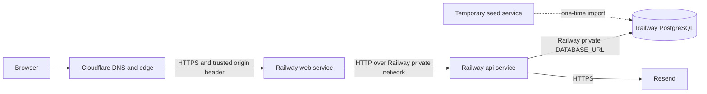

# Campus Gaming Network Railway Deployment Guide

This is the operator runbook for deploying the public Campus Gaming Network (CGN) product to Railway with a private Go API and PostgreSQL database, a public TanStack Start web service, Resend transactional email, and Cloudflare DNS and edge protection. Follow the staging procedure completely before creating a production deployment.

The instructions are dashboard-first and do not require the Railway CLI. Provider screens change over time; when a label has moved, use the linked official page, which includes current screenshots.

This guide does not deploy the unfinished Admin Console. Keep `ADMIN_ENABLED=false` and do not deploy `apps/admin` until the production-hardening and independent-review gate in [20 — Admin Console v1 engineering plan](./20-admin-console-v1-engineering-plan.md) is complete. The separate [22 — Admin Console access runbook](./22-admin-console-access-runbook.md) governs its eventual Cloudflare Access setup and rollout.

## The finished public deployment



Only `web` is publicly addressable. `api` and `postgres` communicate inside the Railway environment and must not receive public domains or TCP proxies. Railway provides a private DNS name for every service, scoped to its project and environment, and recommends plain HTTP for traffic that stays on that private network.<sup>[[1]](#source-1)</sup>

## Read this before creating services

### The checked-in Railway TOML files are legacy references

The repository contains `railway/web.toml`, `railway/api.toml`, and `railway/seed.toml`. They accurately describe the intended commands and health checks, but Railway deprecated service-level Config as Code in 2026. New services cannot opt into those TOML files, and existing users face a December 1, 2026 cutoff. Railway now prefers project-level Infrastructure as Code in `.railway/railway.ts`.<sup>[[2]](#source-2)</sup>

For the first deployment:

1. Configure the values from this guide directly in the Railway dashboard.
2. Do **not** set `/railway/web.toml`, `/railway/api.toml`, or `/railway/seed.toml` as a service config-file path.
3. After staging is accepted, migrate the live project to `.railway/railway.ts` using `railway config pull`, review the result, and then manage it with `railway config plan` and `railway config apply`.<sup>[[3]](#source-3)</sup>

This avoids making the first launch depend on Railway's still-evolving IaC SDK while also avoiding a dead-end legacy configuration.

### Keep the repository root as the build context

Both application Dockerfiles copy files from multiple top-level directories. The web build needs the root lockfile and workspace manifests; the API image copies `db/migrations` and `data/schools_seed.csv`. Therefore:

- Set **Root Directory** to `/` or leave it at the repository root.
- Do not set the root to `/apps/web` or `/apps/api`.
- Set a custom Dockerfile path for each service instead.

Railway supports custom Dockerfile paths, and its monorepo guidance distinguishes the build root from the Dockerfile location.<sup>[[4]](#source-4)</sup>

### Plan and cost controls

Hobby is sufficient for a staging rehearsal. Pro is recommended for a public production launch because CGN is a production service and benefits from higher limits, longer log retention, workspace controls, and priority support. Railway bills running resources by the minute in addition to its plan minimum; all environments in the project contribute to usage.<sup>[[5]](#source-5)</sup>

Before deploying, open **Workspace → Usage → Set Usage Limits** and configure:

- A custom email alert at the amount that should prompt investigation.
- A hard limit with enough headroom that ordinary growth does not unexpectedly take the site offline.

A Railway hard limit stops workloads when reached, so it is a last-resort control rather than an ordinary budget notification.<sup>[[6]](#source-6)</sup>

## Values and access to prepare

Complete this worksheet before creating services. Do not place secret values in Git, issue trackers, screenshots, or chat transcripts.

| Item                  | Recommended value or decision                            | Ready |
| --------------------- | -------------------------------------------------------- | ----- |
| Railway workspace     | Workspace that will own production billing               | [ ]   |
| Railway project name  | `campus-gaming-network`                                  | [ ]   |
| Staging branch        | `next`                                                   | [ ]   |
| Production branch     | `main`                                                   | [ ]   |
| Railway region        | One US region for `web`, `api`, and `postgres`           | [ ]   |
| GitHub access         | Railway GitHub App can read `Campus-Gaming-Network/core` | [ ]   |
| Production domain     | `campusgamingnetwork.com` in Cloudflare                  | [ ]   |
| Resend domain         | `campusgamingnetwork.com` verified for sending           | [ ]   |
| Staging Resend key    | Sending-only key, stored in a password manager           | [ ]   |
| Production Resend key | Different sending-only key, stored in a password manager | [ ]   |
| Alert recipient       | Monitored operational email address                      | [ ]   |
| Launch operator       | Person responsible for deploy and rollback               | [ ]   |

Choose **US West Metal (`us-west2`)** when the initial community and operator are primarily on the West Coast. Choose **US East Metal (`us-east4-eqdc4a`)** when the initial audience is concentrated in the eastern United States. Keep all three long-running services in the same region; cross-region database calls add latency, and moving a database volume later causes downtime.<sup>[[7]](#source-7)</sup>

### Generate environment-specific secrets

Generate two secrets for staging and two different secrets for production:

```bash
openssl rand -hex 32
openssl rand -hex 32
```

Label and save them in a password manager:

| Environment | Secret                     | Used by                                                                       |
| ----------- | -------------------------- | ----------------------------------------------------------------------------- |
| Staging     | `API_PROXY_SHARED_SECRET`  | `web` and `api`; values must match                                            |
| Staging     | `CLOUDFLARE_ORIGIN_SECRET` | `web`; required at startup even when staging uses its Railway domain directly |
| Production  | `API_PROXY_SHARED_SECRET`  | `web` and `api`; values must match                                            |
| Production  | `CLOUDFLARE_ORIGIN_SECRET` | `web` and the Cloudflare request-header transform                             |

Each generated value is 64 hexadecimal characters, exceeding the application's 32-character minimum. Never reuse a staging value in production.

## Prepare GitHub and Resend

### GitHub

1. Sign in to Railway with the account that should own or administer the deployment.
2. Connect Railway to GitHub.
3. In the Railway GitHub App installation, grant access to `Campus-Gaming-Network/core`.
4. Confirm the repository's GitHub Actions workflow passes on `next`. The existing workflow runs on both `next` and `main`.
5. In each Railway source service, enable **Wait for CI** after connecting the repository. Railway will wait for GitHub Actions check suites and skip a deploy when a workflow fails.<sup>[[8]](#source-8)</sup>

For production, protect `main` with required status checks and disallow force pushes. GitHub branch protection can require successful checks before a pull request merges.<sup>[[9]](#source-9)</sup>

### Resend

The API refuses to start in staging or production without a Resend API key and valid sender addresses.

1. In Resend, add `campusgamingnetwork.com` as a sending domain.
2. Add the exact DKIM, SPF, and MX records Resend displays to Cloudflare. Keep Resend's verification records DNS-only. Resend can also add the records with its Cloudflare Domain Connect flow.<sup>[[10]](#source-10)</sup>
3. Do not enable Resend inbound receiving for this deployment. Existing inbound mail, if any, should stay with its current provider.
4. Wait until Resend reports the domain as **Verified**.
5. Create two API keys:
   - `CGN Staging` — **Sending access**, restricted to the verified domain.
   - `CGN Production` — **Sending access**, restricted to the verified domain.
6. Copy each key once into the password manager. Resend only displays a newly created key once.<sup>[[11]](#source-11)</sup>

Once a domain is verified, Resend permits sending from any address on that domain; no separate sender identity is required.<sup>[[12]](#source-12)</sup> This deployment uses:

```text
account@campusgamingnetwork.com
events@campusgamingnetwork.com
```

Staging sends real email—Resend does not have a production-approval sandbox—so use only controlled tester addresses during rehearsal.<sup>[[13]](#source-13)</sup>

## Build the staging environment

### 1. Create the project and environment

1. Open the [Railway dashboard](https://railway.com/dashboard).
2. Choose **New Project → Empty Project**.
3. Name it `campus-gaming-network`.
4. Open the environment selector and create a persistent environment named `staging`.
5. Switch to `staging` before adding resources.
6. Select the chosen region for every service created below.

Railway creates a `production` environment by default. Leave it empty or undeployed until the entire staging acceptance checklist passes. Railway settings, services, variables, and data are isolated by environment.<sup>[[14]](#source-14)</sup>

### 2. Create PostgreSQL

1. In the staging canvas, choose **New → Database → PostgreSQL**.
2. Rename the service exactly `postgres`.
3. Verify a persistent volume is attached.
4. Verify the service is in the selected region.
5. Under **Networking**, confirm there is no public TCP proxy.
6. Under **Variables**, confirm `DATABASE_URL` exists.

Railway's PostgreSQL template is private by default and supplies `DATABASE_URL`, `PGHOST`, `PGPORT`, `PGUSER`, `PGPASSWORD`, and `PGDATABASE`.<sup>[[15]](#source-15)</sup> CGN only references `DATABASE_URL`.

The application and CI are validated against PostgreSQL 16. Confirm the service image uses PostgreSQL major version 16. If Railway's template defaults to a different major, use Railway's official `postgres-ssl:16` major tag or pause and validate the new major before proceeding. Railway's official image project publishes major tags and recommends a major rather than a minor pin when using PITR.<sup>[[16]](#source-16)</sup>

### 3. Create the `api` service

Create the source service without starting a deployment so its configuration can be staged first.

1. Choose **New → GitHub Repo**, select `Campus-Gaming-Network/core`, and choose **Add Variables** rather than **Deploy Now**. If that choice is not shown, create an empty service and disable autodeploy before connecting the source.
2. Rename the service exactly `api`. Under **Settings → Source**, select branch `next`.
3. Set **Root Directory** to `/`.
4. Select the Dockerfile builder and set **Dockerfile Path** to `/apps/api/Dockerfile`. If the dashboard exposes only a variable, add `RAILWAY_DOCKERFILE_PATH=/apps/api/Dockerfile`.
5. Configure the deployment values below.

| API setting             | Value                          |
| ----------------------- | ------------------------------ |
| Start command           | `cgn-api`                      |
| Pre-deploy command      | `cgn-migrate -dir /migrations` |
| Pre-deploy timeout      | `120` seconds                  |
| Health-check path       | `/ready`                       |
| Health-check timeout    | `120` seconds                  |
| Restart policy          | `On Failure`                   |
| Maximum restarts        | `10`                           |
| Draining time           | `10` seconds                   |
| Replicas                | `1`                            |
| Public domain/TCP proxy | None                           |

The pre-deploy command runs inside the private network with service variables. If it exits nonzero, Railway does not activate the new deployment.<sup>[[17]](#source-17)</sup> The API image contains both `cgn-migrate` and `/migrations`, and `/ready` succeeds only when PostgreSQL is reachable.

Keep the API at one replica for the first release. The current rate limiter is process-local, so multiple replicas would each enforce an independent quota.

Recommended API watch paths:

```text
.dockerignore
apps/api/**
db/migrations/**
data/schools_seed.csv
```

### 4. Add staging API variables

Open `api` → **Variables → Raw Editor** and add:

```text
DEPLOYMENT_ENV=staging
API_DATABASE_URL=${{postgres.DATABASE_URL}}
API_SITE_URL=https://REPLACE-WITH-STAGING-WEB-DOMAIN
API_SESSION_COOKIE=cgn_session
API_COOKIE_SECURE=true
API_RESEND_API_KEY=REPLACE-WITH-STAGING-RESEND-KEY
API_ACCOUNT_EMAIL_FROM=CGN Accounts <account@campusgamingnetwork.com>
API_EVENTS_EMAIL_FROM=CGN Events <events@campusgamingnetwork.com>
API_CATALOG_REFRESH_INTERVAL=24h
API_PROXY_SHARED_SECRET=REPLACE-WITH-STAGING-SHARED-SECRET
ADMIN_ENABLED=false
```

Do not deploy yet because the staging web domain does not exist. Keep `ADMIN_ENABLED=false`; the additive Admin Console migrations may be present while its privileged routes remain disabled. Do not add any `API_DEV_SEED_USER_*` variables outside local development. `API_MAINTENANCE_TOKEN` is optional and should remain unset until the immediate catalog-refresh endpoint is operationally needed.

Railway reference-variable syntax keeps the database URL synchronized without copying credentials by hand.<sup>[[18]](#source-18)</sup>

### 5. Create the `web` service and staging domain

1. Choose **New → GitHub Repo**, select the same repository, and choose **Add Variables** rather than **Deploy Now**. If necessary, use an empty service with autodeploy disabled during setup.
2. Rename the service exactly `web` and select source branch `next`.
3. Set **Root Directory** to `/`.
4. Set **Dockerfile Path** to `/apps/web/Dockerfile`, using `RAILWAY_DOCKERFILE_PATH=/apps/web/Dockerfile` if necessary.
5. Configure the following deployment values.

| Web setting          | Value                              |
| -------------------- | ---------------------------------- |
| Start command        | `node src/production-preflight.ts` |
| Health-check path    | `/api/health`                      |
| Health-check timeout | `120` seconds                      |
| Restart policy       | `On Failure`                       |
| Maximum restarts     | `10`                               |
| Draining time        | `10` seconds                       |
| Replicas             | `1` initially                      |

6. Open **Settings → Networking → Public Networking** and choose **Generate Domain**.
7. Copy the full HTTPS origin, for example `https://cgn-staging-example.up.railway.app`. Do not include a trailing path.

Recommended web watch paths:

```text
.dockerignore
apps/docs/package.json
apps/web/**
package.json
package-lock.json
```

Railway injects `PORT` and uses the same port for health checks. Both CGN services already listen on that variable, so do not create or hard-code a `PORT` variable.<sup>[[19]](#source-19)</sup>

### 6. Add staging web variables

Open `web` → **Variables → Raw Editor** and add:

```text
DEPLOYMENT_ENV=staging
API_INTERNAL_URL=http://${{api.RAILWAY_PRIVATE_DOMAIN}}:${{api.PORT}}
API_SESSION_COOKIE=cgn_session
API_PROXY_SHARED_SECRET=REPLACE-WITH-STAGING-SHARED-SECRET
CLOUDFLARE_ORIGIN_SECRET=REPLACE-WITH-STAGING-CLOUDFLARE-SECRET
SITE_URL=https://REPLACE-WITH-STAGING-WEB-DOMAIN
NODE_ENV=production
```

Return to the API variables and replace `https://REPLACE-WITH-STAGING-WEB-DOMAIN` with the same exact origin. The two `API_PROXY_SHARED_SECRET` values must match exactly.

Staging does not need a Cloudflare header transform when it uses the Railway domain directly. Nevertheless, the application requires a unique `CLOUDFLARE_ORIGIN_SECRET` in strict staging mode so an unsafe configuration can never be promoted silently.

### 7. Review secrets and staged changes

Before applying:

- Confirm no secret appears in a service description, command, or repository path.
- Confirm API and web use the same staging proxy secret.
- Confirm the Resend key is on `api` only.
- Confirm the Cloudflare origin secret is on `web` only.
- Confirm `ADMIN_ENABLED=false` and that no `admin` service is deployed.
- Confirm `api` and `postgres` have no public networking.
- Confirm every service is in the same region.
- Enable **Wait for CI** on `api` and `web`.

Apply the staged changes. After a secret is proven to work, use the variable's three-dot menu to **Seal** it. Sealed variables remain available to deployments but cannot be read from the dashboard, API, or CLI. They are not copied to duplicated or PR environments, which is why every environment needs its own secret entry.<sup>[[20]](#source-20)</sup>

### 8. Deploy the API

Deploy `api` first. In its deployment details, confirm this sequence:

1. Docker image builds successfully.
2. Pre-deploy logs contain `database migrations applied`.
3. Application logs contain `api listening`.
4. The `/ready` health check succeeds.
5. Railway marks the deployment active.

If strict validation fails, the log lists missing variable names without printing their values. Correct the variables and redeploy. A failed pre-deploy migration does not replace a previously healthy API deployment.

### 9. Run the one-time school seed

Only create the seed service after the API migration succeeds.

1. Choose **New → Empty Service** and name it exactly `seed`.
2. Keep Root Directory `/` and Dockerfile Path `/apps/api/Dockerfile`.
3. Set start command to `cgn-seed -csv /data/schools_seed.csv`.
4. Set restart policy to **Never** and replicas to `1`.
5. Add only these variables:

   ```text
   DEPLOYMENT_ENV=local
   API_DATABASE_URL=${{postgres.DATABASE_URL}}
   ```

6. Confirm there is no public networking.
7. Connect `Campus-Gaming-Network/core`, branch `next`, and deploy once.
8. Read the final logs.

Successful first-run logs contain both fields below (the exact punctuation depends on Railway's log formatter):

```text
school seed imported rows=6243
```

The six launch games are inserted by database migration `000003`, not by this service. A second seed run safely reports that the catalog was already populated. After capturing the successful log, disconnect its GitHub source or delete `seed`.

### 10. Deploy and verify the web service

Deploy `web`. Its startup preflight validates the environment before Nitro opens its port. The `/api/health` Railway health check then calls the private API's `/health`; a `200` proves both the web process and web-to-API private network path are working.

From the repository root on a local computer, run:

```bash
./scripts/smoke_test.sh https://REPLACE-WITH-STAGING-WEB-DOMAIN
```

The script checks the homepage, web/API health path, schools, events, and teams. Railway health checks only gate a new deployment; they are not continuous uptime monitoring after activation.<sup>[[19]](#source-19)</sup>

## Staging acceptance checklist

Do not create the production deployment until all checks pass.

- [ ] `/api/health` returns HTTP 200 and reports both services healthy.
- [ ] School search returns the imported catalog.
- [ ] The six launch games appear in event filters.
- [ ] Signup requires the 18+ confirmation and a home school.
- [ ] Signup sends a verification email to a controlled tester.
- [ ] Verification requires explicit confirmation; login and logout work.
- [ ] Forgot-password and reset-password emails work.
- [ ] Secure session cookies are present and browser operations show no mixed-content errors.
- [ ] School follow and unfollow work.
- [ ] Event create, edit, RSVP yes, and cancellation work.
- [ ] RSVP email includes a calendar attachment.
- [ ] Only organizers can see or perform event edit/delete actions.
- [ ] Paid-event instructions link off-site and do not imply CGN checkout.
- [ ] Team create, password join, captain controls, and ownership transfer work.
- [ ] Dashboard sections load for an authenticated user.
- [ ] Logged-out support submission works; logged-in report submission works.
- [ ] A locked private event's HTML source contains none of its real title, description, location, address, or password; its page title is generic and it is `noindex`.
- [ ] Missing events, schools, teams, and profiles return HTTP 404 rather than a soft-404 HTTP 200.
- [ ] Public event and school pages contain distinct title, description, and Open Graph metadata.
- [ ] `api` and `postgres` still have no public domain or TCP proxy.
- [ ] Railway logs contain no credentials or full environment dumps.

Useful status-code check:

```bash
curl --silent --output /dev/null --write-out '%{http_code}\n' \
  https://REPLACE-WITH-STAGING-WEB-DOMAIN/events/definitely-missing
```

Expected result: `404`.

## Backups and restore rehearsal

Railway PostgreSQL is an unmanaged database service: Railway supplies the container and platform features, while the operator remains responsible for backup policy, restore testing, monitoring, and maintenance.<sup>[[15]](#source-15)</sup>

In staging:

1. Open `postgres` → **Backups**.
2. Enable daily and weekly volume backups; monthly is also recommended.
3. Trigger a manual backup after staging data exists.
4. Restore that backup. Railway stages a replacement volume rather than applying it immediately.
5. Review the staged volume change and deploy it.
6. Confirm API `/ready`, school search, signup, and event creation.
7. Record the backup timestamp, restore duration, and validation result.

Railway's scheduled retention is currently six days for daily backups, one month for weekly backups, and three months for monthly backups. Restores are limited to the same project and environment. Wiping a volume also deletes its volume backups, so volume snapshots are not a substitute for a later off-site logical backup strategy.<sup>[[21]](#source-21)</sup>

Before production's first migration, enable the schedules and create a manual backup. Point-in-time recovery is a useful post-launch enhancement, but it is not required for the initial rehearsal.<sup>[[22]](#source-22)</sup>

## Build the production environment

Production must use its own PostgreSQL volume and its own secrets. Do not point production at staging's database or reuse its Resend key.

1. Switch to the Railway `production` environment.
2. Recreate the same `postgres`, `api`, and `web` topology. With only three services, manual mirroring is safer than syncing unreviewed staging secrets.
3. Connect `api` and `web` to branch `main`.
4. Apply the same Dockerfile, command, health-check, restart, region, watch-path, and single-replica settings used in staging.
5. Create new production secret values and set the variables below.
6. Enable Wait for CI.
7. Enable daily and weekly PostgreSQL backups; add monthly if available.
8. Trigger and retain a manual pre-launch backup.

### Production API variables

```text
DEPLOYMENT_ENV=production
API_DATABASE_URL=${{postgres.DATABASE_URL}}
API_SITE_URL=https://campusgamingnetwork.com
API_SESSION_COOKIE=cgn_session
API_COOKIE_SECURE=true
API_RESEND_API_KEY=REPLACE-WITH-PRODUCTION-RESEND-KEY
API_ACCOUNT_EMAIL_FROM=CGN Accounts <account@campusgamingnetwork.com>
API_EVENTS_EMAIL_FROM=CGN Events <events@campusgamingnetwork.com>
API_CATALOG_REFRESH_INTERVAL=24h
API_PROXY_SHARED_SECRET=REPLACE-WITH-PRODUCTION-SHARED-SECRET
ADMIN_ENABLED=false
```

### Production web variables

```text
DEPLOYMENT_ENV=production
API_INTERNAL_URL=http://${{api.RAILWAY_PRIVATE_DOMAIN}}:${{api.PORT}}
API_SESSION_COOKIE=cgn_session
API_PROXY_SHARED_SECRET=REPLACE-WITH-PRODUCTION-SHARED-SECRET
CLOUDFLARE_ORIGIN_SECRET=REPLACE-WITH-PRODUCTION-CLOUDFLARE-SECRET
SITE_URL=https://campusgamingnetwork.com
NODE_ENV=production
```

Deploy in the same order as staging:

1. `postgres`
2. `api` and its automatic migrations
3. temporary `seed`, confirming 6,243 imported rows, then remove it
4. `web`
5. public smoke test on the generated Railway web domain

Authenticated operations on the generated production Railway domain may be rejected because the canonical application origin is already `https://campusgamingnetwork.com`. Complete authenticated production checks after the custom domain is active.

## Connect Cloudflare and the production domain

### 1. Add the Railway custom domain

1. Open production `web` → **Settings → Networking → Custom Domain**.
2. Enter `campusgamingnetwork.com`.
3. Railway displays a CNAME target and a TXT ownership-verification record.
4. In Cloudflare DNS, add both records exactly as Railway displays them:
   - Apex CNAME (`@`) → Railway target, **Proxied** (orange cloud).
   - TXT verification record → exact Railway name and value.
5. In Cloudflare **SSL/TLS**, set encryption mode to **Full**, as Railway's Cloudflare instructions require; Railway warns that Full (Strict) does not work as intended for this integration.<sup>[[23]](#source-23)</sup>
6. Wait until Railway shows the custom domain as verified/active.

Both the CNAME and TXT records are required. A missing verification TXT record can produce a Railway 404 even when DNS resolves.<sup>[[23]](#source-23)</sup>

### 2. Add the trusted Cloudflare origin header

The application trusts `CF-Connecting-IP` only when Cloudflare overwrites a second secret header. This prevents a client connecting directly to Railway from spoofing Cloudflare's visitor-IP header.

1. In Cloudflare, open **Rules → Overview**.
2. Choose **Create rule → Request Header Transform Rule**.
3. Name it `CGN trusted origin header`.
4. Match requests where hostname equals `campusgamingnetwork.com`.
5. Choose **Set static**.
6. Set header name to `X-CGN-Cloudflare-Secret`.
7. Set its value to the exact production `CLOUDFLARE_ORIGIN_SECRET` stored on the Railway web service.
8. Deploy the rule.

Cloudflare's static operation overwrites a client-supplied header with the value defined at the edge. Request-header transform rules are available on all Cloudflare plans, although some advanced expression features vary by plan.<sup>[[24]](#source-24)</sup>

### 3. Redirect `www` to the apex

1. Add a proxied Cloudflare CNAME named `www` pointing to `@`.
2. Open **Rules → Redirect Rules → Single Redirects**.
3. Match `https://www.campusgamingnetwork.com/*`.
4. Redirect to the matching path on `https://campusgamingnetwork.com/`.
5. Use HTTP `301` and preserve the query string.

Cloudflare publishes a current dashboard example for this exact pattern.<sup>[[25]](#source-25)</sup>

### 4. Run public acceptance again

```bash
./scripts/smoke_test.sh https://campusgamingnetwork.com
```

Repeat the authenticated staging checklist using production tester accounts. Confirm Cloudflare is proxied, HTTPS works without redirect loops, and `www` retains paths and query strings while redirecting to the apex.

## Monitoring and routine operation

Railway captures application stdout/stderr plus build, deployment, HTTP, DNS, and network logs. The environment-level Log Explorer can query across services; useful filters include `@level:error` and `@httpStatus:>=500`.<sup>[[26]](#source-26)</sup>

Before launch:

- Enable Railway email and in-app notifications for failed deployments and crashes.
- Confirm the workspace billing alert reaches a monitored inbox.
- Familiarize the launch operator with service metrics and the Log Explorer.
- Add an external HTTPS uptime check for `https://campusgamingnetwork.com/api/health`, because Railway's deployment health check is not continuous monitoring.
- Watch API memory, database memory/storage, HTTP 5xx responses, and Resend delivery failures during the first launch window.
- Review cost after staging has run for one week, then right-size from measured CPU and memory rather than guesses.<sup>[[27]](#source-27)</sup>

Do not scale the API beyond one replica until rate limiting moves to a shared store. The stateless web tier can be scaled independently if traffic requires it.

## Rollback and recovery

### Web or API regression without a database change

1. Open the affected service's deployment history.
2. Select the last known-good deployment.
3. Choose **Redeploy**.
4. Confirm the configured health check passes before traffic switches.
5. Run the automated smoke test.

Railway can redeploy an earlier build with the same code and deployment configuration.<sup>[[28]](#source-28)</sup>

### Migration fails before deployment

Railway does not activate the new API when `cgn-migrate` exits nonzero. Read the pre-deploy logs, correct the unapplied migration or configuration, commit the fix, and redeploy. Do not bypass the migration command.

### A bad migration was already applied

1. Stop or limit writes if continuing would worsen the damage.
2. Restore the latest verified Railway backup.
3. Review and deploy the staged replacement volume.
4. Redeploy the last application release compatible with the restored schema.
5. Re-run readiness, school search, signup, and event creation checks.
6. Fix forward with a new numbered migration.

Never edit a migration already applied to staging or production, and do not use ad hoc production SQL as the routine migration path.

## Troubleshooting

| Symptom                                                                        | Most likely cause                                                                     | Resolution                                                                                                                   |
| ------------------------------------------------------------------------------ | ------------------------------------------------------------------------------------- | ---------------------------------------------------------------------------------------------------------------------------- |
| Docker build cannot find `package-lock.json`, `db/migrations`, or the seed CSV | Root Directory points at an app subdirectory                                          | Reset Root Directory to `/`; keep the custom Dockerfile path                                                                 |
| API pre-deploy fails with `unsafe staging configuration`                       | A strict-mode API variable is missing or invalid                                      | Correct every variable named in the log; Resend and site variables are required even for the migrator                        |
| API health check fails                                                         | API cannot reach PostgreSQL, wrong `API_DATABASE_URL`, or process did not bind `PORT` | Confirm `${{postgres.DATABASE_URL}}`, same environment/region, and do not override `PORT`                                    |
| Web reports `api_unreachable`                                                  | Wrong private URL or service name                                                     | Service must be named `api`; use `http://${{api.RAILWAY_PRIVATE_DOMAIN}}:${{api.PORT}}`                                      |
| Seed logs `school seed skipped`                                                | Schools table was already populated                                                   | Treat as expected only on a rerun; investigate if a supposedly fresh environment was not empty                               |
| Resend returns 403                                                             | Key invalid, domain unverified, or From domain mismatch                               | Verify domain status, key scope, and exact sender domain<sup>[[29]](#source-29)</sup>                                        |
| Custom domain returns 404                                                      | Railway TXT record is absent or incorrect                                             | Add both Railway-provided CNAME and TXT records and wait for verification                                                    |
| Cloudflare shows too many redirects                                            | Proxy or SSL/TLS mode is incorrect                                                    | Keep apex CNAME proxied and use SSL/TLS mode Full per Railway guidance                                                       |
| Deployment never starts after a push                                           | Wrong branch, failed CI, watch path mismatch, or GitHub permissions                   | Check skipped deployments, Wait for CI, source branch, Railway GitHub App access, and watch paths<sup>[[8]](#source-8)</sup> |
| Unexpected bill growth                                                         | Both environments running, excess replicas, or public inter-service traffic           | Review usage by service, use private URLs, remove `seed`, and tune limits                                                    |

## Launch record

Copy this table into the launch issue and complete it for each environment.

| Gate                              | Staging         | Production |
| --------------------------------- | --------------- | ---------- |
| Git commit SHA                    |                 |            |
| Railway region                    |                 |            |
| API migration deployment ID       |                 |            |
| School seed log captured: 6,243   |                 |            |
| Automated smoke test passed       |                 |            |
| Authenticated checklist passed    |                 |            |
| Backup schedules enabled          |                 |            |
| Manual backup timestamp           |                 |            |
| Restore rehearsal date/result     |                 |            |
| Resend delivery verified          |                 |            |
| API/Postgres confirmed private    |                 |            |
| Cloudflare domain/header/redirect | N/A unless used |            |
| Operator and rollback owner       |                 |            |
| Final acceptance time             |                 |            |

## Sources

Provider behavior and dashboard procedures were verified against these primary sources on September 14, 2026.

1. <a id="source-1"></a>Railway. “[Working with Domains: Private domains](https://docs.railway.com/networking/domains/working-with-domains).” Accessed September 14, 2026.
2. <a id="source-2"></a>Railway. “[Using Config as Code](https://docs.railway.com/config-as-code).” Accessed September 14, 2026.
3. <a id="source-3"></a>Railway. “[CLI and Infrastructure as Code commands](https://docs.railway.com/cli).” Accessed September 14, 2026; Railway, “[Infrastructure as Code SDK](https://github.com/railwayapp/railway-ts-sdk).” Accessed September 14, 2026.
4. <a id="source-4"></a>Railway. “[Dockerfiles](https://docs.railway.com/builds/dockerfiles).” Accessed September 14, 2026; Railway, “[Deploying a Monorepo](https://docs.railway.com/deployments/monorepo).” Accessed September 14, 2026.
5. <a id="source-5"></a>Railway. “[Pricing Plans](https://docs.railway.com/pricing/plans).” Accessed September 14, 2026; Railway, “[Logs](https://docs.railway.com/observability/logs).” Accessed September 14, 2026.
6. <a id="source-6"></a>Railway. “[Cost Control](https://docs.railway.com/pricing/cost-control).” Accessed September 14, 2026.
7. <a id="source-7"></a>Railway. “[Regions](https://docs.railway.com/deployments/regions).” Accessed September 14, 2026; Railway, “[Troubleshooting Slow Deployments and Applications](https://docs.railway.com/deployments/troubleshooting/slow-deployments).” Accessed September 14, 2026.
8. <a id="source-8"></a>Railway. “[Controlling GitHub Autodeploys](https://docs.railway.com/deployments/github-autodeploys).” Accessed September 14, 2026.
9. <a id="source-9"></a>GitHub. “[About Protected Branches](https://docs.github.com/en/repositories/configuring-branches-and-merges-in-your-repository/managing-protected-branches/about-protected-branches).” Accessed September 14, 2026.
10. <a id="source-10"></a>Resend. “[Cloudflare Domain Verification](https://resend.com/docs/knowledge-base/cloudflare).” Accessed September 14, 2026.
11. <a id="source-11"></a>Resend. “[API Keys](https://resend.com/docs/dashboard/api-keys/introduction).” Accessed September 14, 2026.
12. <a id="source-12"></a>Resend. “[How Do I Create an Email Address or Sender in Resend?](https://resend.com/docs/knowledge-base/how-do-I-create-an-email-address-or-sender-in-resend).” Accessed September 14, 2026.
13. <a id="source-13"></a>Resend. “[Does Resend Require Production Approval?](https://resend.com/docs/knowledge-base/does-resend-require-production-approval).” Accessed September 14, 2026.
14. <a id="source-14"></a>Railway. “[Environments](https://docs.railway.com/environments).” Accessed September 14, 2026; Railway, “[Isolate Staging from Production](https://docs.railway.com/guides/isolate-staging-production).” Accessed September 14, 2026.
15. <a id="source-15"></a>Railway. “[PostgreSQL](https://docs.railway.com/databases/postgresql).” Accessed September 14, 2026.
16. <a id="source-16"></a>Railway. “[SSL-enabled Postgres DB image](https://github.com/railwayapp-templates/postgres-ssl).” Accessed September 14, 2026; Railway, “[Point-in-Time Recovery](https://docs.railway.com/volumes/point-in-time-recovery).” Accessed September 14, 2026.
17. <a id="source-17"></a>Railway. “[Add a Pre-Deploy Command](https://docs.railway.com/deployments/pre-deploy-command).” Accessed September 14, 2026.
18. <a id="source-18"></a>Railway. “[Using Variables](https://docs.railway.com/variables).” Accessed September 14, 2026.
19. <a id="source-19"></a>Railway. “[Healthchecks](https://docs.railway.com/deployments/healthchecks).” Accessed September 14, 2026.
20. <a id="source-20"></a>Railway. “[Lock Down a Production Railway Project](https://docs.railway.com/guides/lock-down-production-project).” Accessed September 14, 2026.
21. <a id="source-21"></a>Railway. “[Back Up and Restore Postgres](https://docs.railway.com/guides/postgres-backups-restores).” Accessed September 14, 2026.
22. <a id="source-22"></a>Railway. “[Point-in-Time Recovery](https://docs.railway.com/volumes/point-in-time-recovery).” Accessed September 14, 2026.
23. <a id="source-23"></a>Railway. “[Working with Domains](https://docs.railway.com/networking/domains/working-with-domains).” Accessed September 14, 2026.
24. <a id="source-24"></a>Cloudflare. “[Create a Request Header Transform Rule in the Dashboard](https://developers.cloudflare.com/rules/transform/request-header-modification/create-dashboard/).” Updated May 5, 2026; Cloudflare, “[Transform Rules](https://developers.cloudflare.com/rules/transform/).” Updated August 14, 2026.
25. <a id="source-25"></a>Cloudflare. “[Redirect from WWW to Root](https://developers.cloudflare.com/rules/url-forwarding/examples/redirect-www-to-root/).” Updated May 5, 2026.
26. <a id="source-26"></a>Railway. “[Logs](https://docs.railway.com/observability/logs).” Accessed September 14, 2026.
27. <a id="source-27"></a>Railway. “[Project Usage](https://docs.railway.com/projects/project-usage).” Accessed September 14, 2026; Railway, “[Right-Size CPU and Memory from Real Metrics](https://docs.railway.com/guides/right-size-cpu-memory).” Accessed September 14, 2026.
28. <a id="source-28"></a>Railway. “[Deployment Actions](https://docs.railway.com/deployments/deployment-actions).” Accessed September 14, 2026.
29. <a id="source-29"></a>Resend. “[403 Error Using a Verified Domain](https://resend.com/docs/knowledge-base/403-error-domain-mismatch).” Accessed September 14, 2026.
