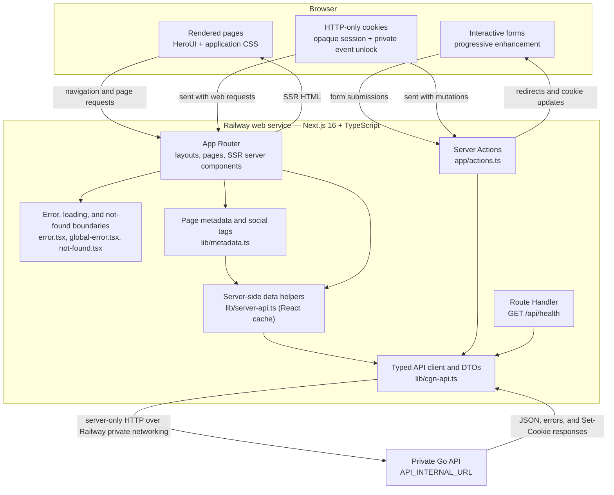
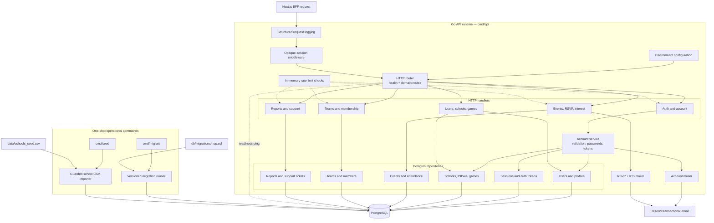
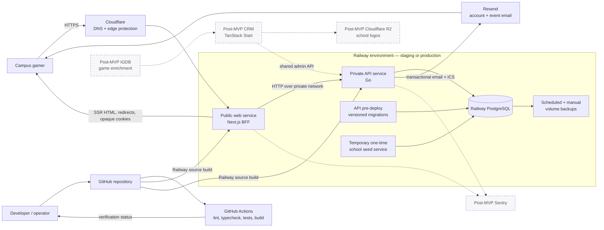

# 14 — Architecture diagrams

These diagrams reflect the current main-site MVP and its Railway deployment plan. In the system overview, dashed components are explicitly post-MVP.

## 1. Frontend architecture overview

Key boundary: the browser talks to Next.js, while Next.js acts as the BFF and calls the Go API. The private API URL and private-event unlock tokens are not exposed to browser JavaScript. Browser authentication uses opaque cookies, not JWTs.

## 2. Backend architecture overview

The Go layer owns authorization, validation, domain rules, transactional writes, rate limits, mail triggers, and persistence. SQL is parameterized, user-facing records use soft deletes where applicable, and `/ready` verifies Postgres connectivity.

## 3. Entire system overview

Production exposes only the Next.js web service. The Go API and PostgreSQL remain on Railway private networking. Migrations run before a new API deployment is activated, the national school seed runs once per fresh environment, and database backups are a launch gate.
