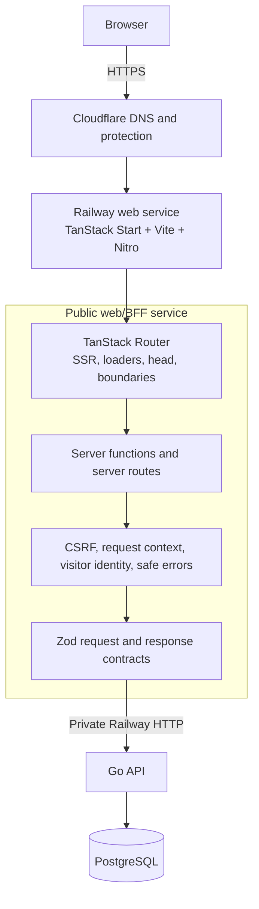
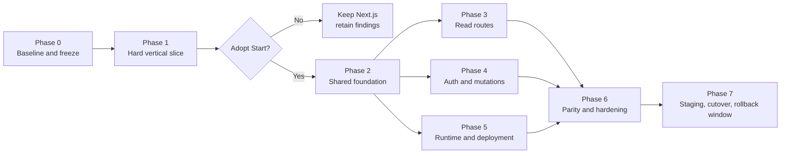

# 18 — TanStack Start main-frontend migration guide

> **Status: proposal.** The current production decision remains Next.js for the
> main site and TanStack Start for the later CRM. This guide describes how to
> evaluate and execute a main-site migration without changing product scope,
> API contracts, or the deployment trust boundary. Adoption requires the
> decision gate in Phase 1.

## Outcome

Replace the Next.js application in `apps/web` with a TanStack Start application
while preserving:

- Every public URL, redirect, query parameter, and important HTTP status.
- Full-document SSR for public, indexable pages.
- The existing React, HeroUI, Tailwind CSS, and accessible HTML experience.
- The web BFF as the only public caller of the private Go API.
- Opaque HTTP-only session cookies and private-event unlock cookies.
- Cloudflare/Railway visitor-identity forwarding and API proxy authentication.
- Zod validation of every successful Go response and every submitted form.
- The Go API as the authority for authentication, authorization, domain rules,
  rate limits, transactions, email, content policy, and persistence.
- The existing Docker Compose, Railway, Cloudflare, CI, and rollback posture.

This is a web-orchestration migration, not a backend rewrite. It must not
require a database migration or an incompatible Go API change.

## Current baseline

Inventory this again at the beginning of the migration; the following numbers
describe the repository when this guide was written:

| Surface | Current size |
|---|---:|
| Next.js page routes | 23 |
| Next.js route handlers | 3 |
| Exported Server Actions | 24 |
| Files importing a Next.js API | 29 |
| TypeScript unit tests | 70 tests in 11 files |
| Playwright coverage | 17 tests in 4 specifications |

Most code in `lib/api-contracts.ts`, `lib/form-validation.ts`,
`lib/action-payloads.ts`, `lib/pass-v0-requests.ts`, and presentation helpers is
framework-neutral. The concentrated migration work is:

1. Route definitions, parameters, search state, metadata, and boundaries.
2. Request-scoped reads of headers and cookies.
3. Server Actions and their `useActionState` consumers.
4. Next.js data caching and invalidation.
5. Build, container, CI, and deployment output.

Before starting, land or deliberately carry forward any active work that
touches environment validation, startup instrumentation, API configuration, or
the BFF. Do not let a framework migration silently discard those changes.

## Target architecture



The browser continues to communicate with one public origin. Server-rendered
requests and client navigations both reach the Start server, which calls the Go
API over Railway private networking. Secrets, raw session tokens, private API
URLs, and private-event unlock tokens never enter browser JavaScript.

### Proposed file shape

```text
apps/web/
  Dockerfile
  package.json
  vite.config.ts
  src/
    router.tsx
    routeTree.gen.ts          generated; never hand-edit
    start.ts                  request middleware, including CSRF
    server.ts                 optional server entry/startup checks
    routes/
      __root.tsx
      index.tsx
      schools.index.tsx
      schools.$slug.tsx
      events.index.tsx
      events.$slug.tsx
      events.$slug.edit.tsx
      teams.index.tsx
      teams.$slug.tsx
      account.tsx
      api.health.ts
      ...
    functions/
      auth.functions.ts
      profile.functions.ts
      schools.functions.ts
      events.functions.ts
      teams.functions.ts
      support.functions.ts
    server/
      cgn-api.server.ts
      request-context.server.ts
      cookies.server.ts
      mutation.server.ts
    components/
    lib/
```

Exact file nesting may follow the current TanStack Router generator's preferred
convention. Route URLs and route IDs, not cosmetic file placement, are the
contract.

## Decisions to lock before porting routes

1. **Use Vite, Nitro, Node 24, and full SSR by default.** Build with Vite and run
   the Nitro output with `node .output/server/index.mjs`. Keep the current
   Railway Node service instead of changing hosts at the same time.
2. **Do not use experimental React Server Components in the initial port.**
   Start route components use ordinary SSR and hydration. Measure the resulting
   route JavaScript before accepting the migration.
3. **Do not add TanStack Query during the port.** Use route loaders and the
   built-in router cache first. Add Query later only for a demonstrated need
   such as optimistic updates or shared normalized data.
4. **Keep Zod at both BFF trust boundaries.** A typed server function does not
   replace runtime validation of browser input or Go responses.
5. **Keep server-only code visibly server-only.** Put environment access,
   headers, cookies, proxy secrets, Go calls, and sensitive logging in
   `*.server.ts` modules imported by server-function handlers.
6. **Return browser-safe loader DTOs.** Loader data is serialized for hydration.
   Return only what the route renders; never return request objects, upstream
   responses, internal headers, session values, unlock tokens, or unredacted
   private-event data. A public route that needs an auth choice normally returns
   `{ authenticated: boolean }`, not a complete profile.
7. **Preserve progressive enhancement.** GET filters/search remain ordinary
   HTML forms. Valid mutation submissions must still complete when JavaScript
   is disabled. Native validation attributes remain on every field.
8. **Keep the old and new environment names during the rollback window.**
   Prefer a server-only `SITE_URL` over a browser-exposed variable. If a value
   truly must enter client code, use a `VITE_` prefix and treat it as public.
9. **Preserve HTTP semantics before improving UX.** Correct 404s, redirects,
   cookie flags, `noindex`, and privacy boundaries take priority over preloading
   or optimistic updates.

## Multi-agent operating model

Use four concurrent lanes: one integration lead and up to three worker agents.
All agents share a working tree, so coordination is based on exclusive file
ownership rather than optimistic conflict resolution.

| Lane | Responsibility | Exclusive/shared-file rules |
|---|---|---|
| Integration lead | Task graph, scaffolding, dependency pins, integration, final validation | Sole owner of package manifests/lockfile, `vite.config.ts`, `router.tsx`, generated route tree, global CSS, and migration docs |
| Platform/security | Server request context, BFF transport, cookies, CSRF, trusted visitor identity, safe errors | Owns `src/server/` foundation; changes its public interfaces only through an agreed handoff |
| Domain slice | One bounded route/action domain at a time | Owns only its assigned routes, forms, and `*.functions.ts` module |
| Verification/deployment | Tests, parity evidence, Docker/Compose, CI, Railway rehearsal | May edit test and deployment files, but asks the lead to make dependency/lockfile changes |

### Coordination rules

- The lead assigns file sets before work starts. No file has two authors in the
  same wave.
- Worker agents do not edit `package-lock.json`, generated route files, root
  scripts, or shared router configuration.
- Do not run the route generator or long-lived development server from multiple
  agents. The lead regenerates the route tree after integrating a wave.
- Workers run focused tests for their slice. The lead runs typecheck, build, and
  the complete suite after each wave.
- Authors do not declare their own security-critical slice complete. A different
  agent reviews auth, cookies, private-event gating, visitor identity, and CSRF.
- Only the auth/account owner may set or clear the session cookie. Only the
  events owner may set or consume private-event unlock cookies. Other domain
  agents consume the shared request API without manipulating security cookies
  or internal identity headers.
- Preserve unrelated worktree changes. Never use reset, checkout, or broad
  format commands to clean another agent's edits.
- Integrate small coherent changes. A route, its loader/server function, and its
  focused tests should arrive together.

### Required work-packet format

Every delegated task must state:

```text
Goal:
Allowed files:
Forbidden/shared files:
Inputs and existing contracts:
Behavioral invariants:
Required tests:
Expected handoff:
```

Every handoff must report:

```text
Files changed:
Behavior preserved or intentionally changed:
Commands run and results:
Assumptions:
Risks or follow-up:
```

## Dependency and delivery sequence



Do not schedule every route in parallel immediately. Phase 1 must settle the
execution model; Phase 2 must stabilize shared server interfaces; only then can
domain agents safely port independent slices.

## Phase 0 — Establish the baseline

**Owner:** integration lead, with verification agent support.

1. Create a dedicated migration branch.
2. Record `git status` and protect unrelated changes.
3. Recount pages, route handlers, actions, Next imports, unit tests, and browser
   tests so task tracking uses the current repository rather than this guide's
   snapshot.
4. Run and record the existing gates:

   ```sh
   npm run check:apps-compose
   npm --prefix apps/web run typecheck
   npm --prefix apps/web run lint
   npm --prefix apps/web run test
   npm --prefix apps/web run test:e2e
   npm --prefix apps/web run build
   npm audit --omit=dev
   ```

5. Capture a production-build baseline for:

   - Per-route JavaScript transferred and parsed.
   - HTML size and whether sensitive data appears in serialized payloads.
   - Cold and warm TTFB for `/`, `/events`, `/events/:slug`, and `/account`.
   - Development startup and representative HMR latency.
   - Correct status, metadata, and cache headers.

6. Write a parity manifest containing every route, allowed method, expected
   authentication behavior, redirect, metadata policy, and loading/error/not-
   found behavior.

**Gate 0:** the Next.js baseline passes. Existing failures are documented and
must not be disguised as migration regressions.

## Phase 1 — Build the hard vertical slice

The spike should live temporarily in `apps/web-start`, use an optional Compose
profile, and run on a different local port. Because every direct child of
`apps/` is a runnable application, it must have its own Dockerfile and same-
named Compose service. Run `npm run check:apps-compose` immediately after
scaffolding it.

The integration lead first creates the pinned scaffold and shared route shell.
Then three agents work in parallel:

### Agent A — Request and security boundary

- Port the base Go API request helper without Next-specific `fetch` options.
- Read incoming cookies and trusted hosting headers from Start request context.
- Reproduce `apiRequestFromBFF` visitor-IP normalization and authenticated
  forwarding; never trust browser-supplied internal identity headers.
- Mirror Go `Set-Cookie` values exactly on login/logout.
- Add Start's CSRF middleware explicitly if a custom `start.ts` is present.
  Configure the canonical `SITE_URL` origin, protect anonymous as well as
  authenticated mutations, and do not allow requests with no origin evidence.
- Carry startup environment validation into the Start server entry.

### Agent B — Representative route and mutation

- Port `/events/:slug` with a typed parameter, loader, dynamic `head`, pending
  UI, not-found boundary, and safe error boundary.
- Preserve generic metadata and body data for a locked private event.
- Port login and one RSVP mutation.
- Keep the private-event unlock token in an HTTP-only cookie.
- Implement client invalidation/navigation after the mutation without adding
  TanStack Query.

### Agent C — Verification harness

- Point a copy of the fake-API Playwright harness at the spike.
- Add direct HTTP assertions for status and response headers.
- Exercise the Nitro production build, not just the Vite development server.
- Compare JavaScript and SSR output with the Phase 0 baseline.

### Phase 1 adoption gate

Proceed only when all of the following are demonstrated:

- A missing event returns HTTP 404 before streaming commits a 200.
- A locked event leaks neither its title nor description through HTML, metadata,
  serialized loader data, logs, or client JavaScript.
- Login, authenticated SSR, logout, and cookie deletion work with the exact
  expected cookie flags.
- RSVP works with JavaScript and has a functional valid-submission no-JS path.
- Cross-site server-function requests are rejected without blocking legitimate
  Cloudflare/Railway traffic.
- The trusted visitor header and proxy secret reach Go only when derived from a
  trusted request boundary.
- `/api/health` returns a direct 200 or 503 as appropriate and never redirects.
- The production Nitro image starts from `.output` and honors `PORT`.
- Route JavaScript and hydration cost are understood and accepted. Do not infer
  a production speedup from Vite development performance.
- The route, form, cookie, and middleware code is materially clearer or safer
  than the current implementation.

If the gate fails, stop. Keep the spike findings, remove the temporary app from
the migration branch, and continue with Next.js.

## Phase 2 — Establish the shared Start foundation

After the adoption decision, make `apps/web-start` the parity target while the
current `apps/web` remains runnable.

### Integration lead

- Pin the approved Start, Router, Vite, Nitro, React plugin, and Tailwind Vite
  dependencies exactly; update the lockfile once.
- Establish `vite.config.ts`, `src/router.tsx`, `src/routes/__root.tsx` conventions, route
  tree generation, aliases, and TypeScript includes.
- Create safe default pending, error, and not-found components.
- Port global CSS without opportunistic visual redesign.
- Define route and server-function naming conventions.

### Platform/security agent

- Split the framework-neutral API client from request-bound server helpers.
- Expose narrow helpers such as `incomingCookieHeader`, `requireProfile`,
  `optionalProfile`, `eventUnlockHeader`, and `callGoFromBFF`.
- Put CSRF, visitor identity, correlation IDs, and safe server logging in shared
  middleware.
- Derive request identity only from the server request. Never accept cookies,
  proxy secrets, visitor IP, or a trusted request context through client input
  or a client-provided context mechanism.
- Ensure a route `beforeLoad` guard is UX only; every private server function
  still authorizes its own request through Go or an equivalent server check.

### Shared data policy

- Keep user/session/event/team data uncached or explicitly private.
- Give catalog route data a client `staleTime` comparable to the current five-
  minute policy.
- Do not claim that client router caching replaces Next's cross-request server
  cache. Initially rely on the Go service's existing in-memory school catalog
  over the private network. Add a small bounded Start-server cache only if
  measurements show it is needed.
- Preserve `Cache-Control: public` only for responses proven to contain no
  viewer, session, tenant, or unlock-dependent fields.
- Use `router.invalidate()` after mutations. Prefer scoped invalidation when
  route keys make it reliable; otherwise invalidate all active route data and
  keep the behavior explicit.

**Gate 2:** the root shell, shared server boundary, error policy, route
generation, focused platform tests, typecheck, production build, and Docker
startup all pass before domain work begins.

## Phase 3 — Port read routes in parallel

Give each domain agent complete ownership of its route files and focused tests.
Port loaders and route components together; do not leave components importing
temporary Next shims longer than one wave.

| Work package | Routes | Key checks |
|---|---|---|
| Shell and static | `/about`, `/faq`, `/privacy`, `/terms` | Root head/template, canonical navigation, SSR, no visual drift |
| Home and schools | `/`, `/schools`, `/schools/:slug`, `/api/schools` | Catalog failure fallback, typed filters, pagination/search, follow-state privacy |
| Public identity | `/users/:id` | Dynamic head, verification indicators, true 404, report target |
| Events read side | `/events`, `/events/:slug` | Typed filters/cursors, dynamic/private metadata, lifecycle display, locked-event redaction |
| Teams read side | `/teams`, `/teams/:slug` | Typed filters/cursors, viewer role, dynamic head, true 404 |
| Auth/read flows | `/login`, `/signup`, `/forgot-password`, `/reset-password`, `/auth/reset-password`, `/auth/verify-email` | Typed search/token input, `noindex`, safe redirect target |
| Private screens | `/account`, `/events/new`, `/events/:slug/edit`, `/teams/new` | Route guard UX plus server authorization, no private cache, correct login redirects |
| Support | `/support` | Static metadata plus later mutation integration |

For every route:

1. Define and validate search parameters once in the route.
2. Load required data in parallel where dependencies allow.
3. Convert upstream 404s to the router's not-found control flow.
4. Generate metadata from the same loader result as the body.
5. Ensure `head` never discloses locked, unlisted, token, or authenticated data.
6. Configure the pending component on the exact browse route, never a parent
   that can mask a detail route's status.
7. Use typed `Link` and navigation targets rather than interpolated strings
   where route parameters are available.
8. Return the smallest browser-safe loader value.
9. Port or update the route's focused HTTP and Playwright assertions.
10. Hand off a route record containing its old and new file, validated params
    and search fields, loader DTO, auth/cookie requirements, head and robots
    policy, pending/error/not-found behavior, invalidation targets, test IDs,
    and any remaining parity gap.

**Gate 3:** all 23 page URLs render with status, metadata, authentication,
empty/loading/error behavior, and responsive layout equivalent to Next.js.
Static public pages remain usable when `/me` is unavailable and do not start
anonymous `/me` traffic outside the existing navigation-session behavior.

## Phase 4 — Port auth and mutations by domain

Split the 24-action monolith into server-function modules. Keep shared parsing,
validation, error mapping, and API request builders rather than duplicating
logic in each wrapper.

| Server-function module | Existing actions |
|---|---|
| `auth.functions.ts` | signup, login, logout, forgot/reset password, resend verification, verify email |
| `profile.functions.ts` | update profile, delete account |
| `support.functions.ts` | support ticket, report event, report user |
| `schools.functions.ts` | follow, unfollow |
| `events.functions.ts` | create, update, delete/cancel, unlock, RSVP, interest |
| `teams.functions.ts` | create, join, set captain, transfer ownership |

### Server-function contract

Every mutation must:

1. Use POST for state changes.
2. Accept `FormData` or a serializable typed input and validate it with the
   existing Zod form schema.
3. Derive cookies, visitor identity, and proxy authentication on the server;
   never accept them as function input.
4. Call the existing Go endpoint with the existing response schema.
5. Log contract failures without logging response payloads, form bodies, tokens,
   or personal data.
6. Return the existing accessible `FormState` for expected validation/API
   failures or throw a typed redirect for success.
7. Set/delete cookies before throwing a redirect.
8. Define which route data must be invalidated after success.
9. Authorize the server function independently of any route guard.

### Form integration

Create one small shared adapter that connects a Start server-function client
stub to React submission state. Keep components responsible for labels, native
constraints, accessible field errors, and pending buttons; keep transport and
invalidation out of individual forms.

For no-JS behavior:

- Keep GET filters and school searches as ordinary route forms.
- Use the server function's stable form URL or a thin POST server-route adapter
  backed by the same mutation helper.
- Valid submissions must redirect to the same destinations/notices as today.
- Test what happens to validation failures without JavaScript during the Phase
  1 spike. If Start cannot re-render field state directly, use a bounded flash
  result/redirect adapter rather than duplicating domain logic.
- If enhanced and native submissions need distinct response modes, make the
  distinction in one shared adapter. Never place submitted values, email
  addresses, passwords, verification/reset tokens, unlock tokens, or arbitrary
  backend messages in a redirect query or flash value.
- Never weaken native `required`, length, type, range, or pattern constraints.

### High-risk mutation reviews

A different agent must review:

- Open-redirect protection on login and auth returns.
- Session-cookie mirroring and logout fallback deletion.
- Private-event unlock cookie name, path, expiry, `HttpOnly`, `Secure`, and
  `SameSite` behavior.
- Account deletion's typed confirmation and cookie deletion.
- Team ownership/captain authorization and redirect-only failure notices.
- Cache invalidation after event/team/follow/profile mutations.

**Gate 4:** every existing mutation has focused validation coverage and its
corresponding Playwright flow passes in both development and the production
Nitro server where behavior can differ.

## Phase 5 — Port server routes, runtime, and deployment

### Server routes

| Existing route | Start equivalent | Required behavior |
|---|---|---|
| `/api/health` | GET server route | Proxy Go health; 200 healthy, 503 degraded/unreachable; no redirect |
| `/api/navigation-session` | GET server route | Private, no-store authentication decoration; fail closed to logged-out UI |
| `/api/schools` | GET server route | Validate query/limit, preserve response codes, private 60-second browser cache |

### Environment and startup

- Replace `NEXT_PUBLIC_SITE_URL` with `SITE_URL` unless client code genuinely
  needs it. During rollback, populate both names.
- Keep `API_INTERNAL_URL`, `API_PROXY_SHARED_SECRET`,
  `CLOUDFLARE_ORIGIN_SECRET`, and `API_SESSION_COOKIE` server-only.
- Move Next instrumentation startup validation to a server entry or server-only
  module that runs once per process.
- Confirm production fails or warns according to the repository's current
  environment policy; do not restore insecure development fallbacks in
  production.

### Docker and Compose

- Keep the `web` service name and port 3000 contract.
- Development uses the Vite Start dev server on `0.0.0.0`.
- Production builds once and copies the self-contained `.output` directory to a
  minimal Node 24 runner image.
- Keep the runner non-root.
- Update health checks only if the path changes; the preferred outcome is to
  keep `/api/health` unchanged.
- While `apps/web-start` exists, give it a same-named optional Compose service
  and Dockerfile. Remove that temporary service when it is folded into
  `apps/web`.

### CI and repository docs

- Replace `next typegen` with the Start route-generation/typecheck workflow.
- Keep lint, unit, browser, audit, application-container, and production-build
  gates.
- Add a Nitro production-start smoke test.
- Update the root README, docs 00, 04, 05, 06, 10, 11, 13, and 14, the CI job
  label, and Next-specific agent instructions only after the adoption gate.
- Record the new caching and form decisions in doc 11.

**Gate 5:** Compose, Docker, CI, and a Railway staging build use the same output
and startup command. `/api/health` is accepted by Railway and Nitro honors the
injected `PORT` without a hard-coded production port.

## Phase 6 — Parity, security, and performance hardening

### Automated validation matrix

| Concern | Minimum evidence |
|---|---|
| Route contract | Direct HTTP tests for all URLs, redirects, 404s, and allowed methods |
| Metadata | Title, description, Open Graph, Twitter, canonical URL where applicable, and `noindex` |
| Privacy | HTML/serialized-data assertions for locked events, auth pages, and private responses |
| Auth | Signup, login, authenticated SSR/navigation, logout, reset, verify, expired/invalid session |
| Cookies | Exact name/value forwarding, expiry/deletion, path, `HttpOnly`, `Secure`, and `SameSite` |
| CSRF | Same-origin success and cross-origin server-function rejection |
| BFF identity | Cloudflare authenticated IP, Railway fallback IP, spoof rejection, missing secret |
| Forms | Field errors, pending UI, success/failure notices, redirects, native constraints, valid no-JS submission |
| Cache | No shared caching of viewer data; expected catalog freshness; mutation invalidation |
| Accessibility | Existing Axe/Playwright assertions, focus behavior, live regions, field descriptions |
| Responsive UI | Existing desktop and mobile Chromium projects |
| Runtime | Vite dev, Nitro production process, Docker image, Compose, Railway staging |
| Supply chain | Pinned packages and zero production dependency advisories |

### Full validation commands

The final names may change with the package scripts, but the complete gate must
remain equivalent to:

```sh
npm run check:apps-compose
npm --prefix apps/web run typecheck
npm --prefix apps/web run lint
npm --prefix apps/web run test
npm --prefix apps/web run test:e2e
npm --prefix apps/web run build
npm audit --omit=dev
docker build -f apps/web/Dockerfile .
```

Also run a production-process smoke test against the built Nitro server and the
real Go/Postgres stack. The fake API is valuable for deterministic UI coverage
but is not sufficient evidence for cookies, proxy identity, private networking,
or end-to-end request compatibility.

### Static checks before cutover

- No application source imports `next`, `next/*`, or references `.next`.
- No `"use server"` or Next-generated environment/type file remains.
- No server-only module is reachable from a client bundle except through an
  extracted server-function stub.
- No route returns raw upstream responses or sensitive request context as loader
  data.
- The generated route tree matches the parity manifest and is not hand-edited.
- Build logs contain no route, hydration, serialization, or server-function ID
  warnings.

### Performance decision

Compare the same production paths and data as Phase 0. The migration must not be
accepted merely because Vite feels faster in development. Review:

- Route JavaScript and third-party chunks.
- Hydration duration on representative mobile hardware.
- SSR TTFB and streaming behavior.
- Client-navigation latency and repeated loader calls.
- BFF-to-Go request count, particularly metadata plus route rendering.
- Nitro process memory and cold startup.

Document accepted regressions with a reason and follow-up owner. Unexplained
regressions block cutover.

## Phase 7 — Stage, cut over, and preserve rollback

### Staging rehearsal

1. Deploy the parity app as a separate staging-only Railway web service or onto
   the existing staging web service after preserving its prior deployment.
2. Use the same private staging Go API and database contract, with staging-only
   secrets and host-scoped cookies.
3. Configure the Cloudflare origin-secret transform for the rehearsal hostname
   when testing that path; also test the direct Railway fallback path.
4. Run the complete automated suite and the deployment-plan manual smoke test.
5. Inspect logs for contract failures, CSRF rejections, redirect loops, repeated
   loader requests, and accidental sensitive output.
6. Soak long enough to exercise session expiry, client navigation after
   mutations, and at least one real deployment restart.

Do not split individual application paths between Next.js and Start in
production. Their server-action/function transports, caches, route trees, and
cookie mutation behavior differ; a whole-web-service cutover is easier to reason
about and roll back.

### Repository cutover

1. Freeze unrelated `apps/web` feature work briefly.
2. Fold the accepted Start app into `apps/web`; remove the temporary
   `apps/web-start` application and Compose service.
3. Regenerate the route tree and lockfile once.
4. Run every Phase 6 gate from a clean install and production build.
5. Merge documentation and deployment updates in the same change so the repo no
   longer describes the web service as Next.js.
6. Deploy staging from the exact candidate commit, then promote that commit to
   production.

### Production cutover

- Keep the public hostname, API service, database, cookie names, and health path
  unchanged.
- Keep old and new environment-variable names populated for the rollback
  window.
- Watch health, 4xx/5xx rates, login/logout, CSRF failures, Go API request rate,
  memory, TTFB, and client errors through the first launch window.
- Run smoke tests first on the Railway domain, then through Cloudflare at the
  canonical hostname.

### Rollback

Rollback must remain application-only because this migration makes no database
or incompatible Go API changes.

Rollback immediately for:

- Session-cookie or logout failure.
- Private-event or personal-data disclosure.
- Incorrect authorization or CSRF behavior.
- Missing-route soft 404s or widespread redirect loops.
- Health-check instability or sustained 5xx errors.
- Material unexplained performance regression.

Use Railway's previous successful web deployment/image. Verify `/api/health`,
login, a private event, RSVP, team join, and account access after rollback. Keep
the Start commit and logs for diagnosis; fix forward in staging rather than
patching production interactively.

## Suggested agent waves

With four total concurrency slots, run these waves:

| Wave | Lead | Worker 1 | Worker 2 | Worker 3 |
|---|---|---|---|---|
| 0 | Baseline/task graph | Route inventory | Security inventory | Test/deploy inventory |
| 1 | Scaffold/integrate | Request boundary | Event/login/RSVP slice | Spike verification |
| 2 | Shared router/integrate | Server platform | Error/head helpers | Runtime/CI foundation |
| 3 | Integrate/review | Home/schools/users | Events read side | Teams read side |
| 4 | Integrate/review | Auth/profile | Event mutations | Team/school/support mutations |
| 5 | Full-suite integration | Security adversarial review | Route/metadata parity review | Docker/Railway rehearsal |
| 6 | Cutover candidate | Performance comparison | Browser/accessibility sweep | Documentation/rollback audit |

Rotate reviewers so the author of a security-critical implementation is not its
only reviewer. Keep the lead available for integration rather than consuming
that lane with a large domain port.

## Definition of done

The migration is complete only when:

- All 23 page routes, 3 server routes, and 24 mutations appear in the parity
  manifest and pass their gates.
- The complete unit and Playwright suites pass against development and the
  relevant production-runtime paths.
- No private or viewer-specific data is publicly cached or unnecessarily
  serialized.
- Session, unlock, CSRF, trusted proxy, safe redirect, and account-deletion
  invariants pass independent review.
- Production Docker, Compose, and Railway health checks are verified.
- Performance comparison is recorded and accepted.
- Next.js packages, files, runtime assumptions, and documentation are removed.
- The previous Next.js deployment remains immediately recoverable through the
  agreed rollback window.
- Architecture and implementation-decision docs reflect the adopted design.

## Effort estimate

For one integration lead and three active worker lanes, budget approximately:

| Work | Focused elapsed time |
|---|---:|
| Baseline and hard vertical slice | 2–3 days |
| Shared foundation | 2–3 days |
| Read-route parity | 2–4 days |
| Auth, forms, and mutations | 4–6 days |
| Runtime, CI, hardening, and staging | 3–5 days |

Parallelism shortens elapsed time but does not remove integration and review.
Expect roughly two focused weeks plus staging soak if the Phase 1 execution
model works cleanly. Stop and re-estimate if form fallback, client bundle size,
or cross-request caching needs a new subsystem.

## Primary references

- [TanStack Start overview](https://tanstack.com/start/latest/docs/framework/react/overview)
- [Migrate from Next.js](https://tanstack.com/start/latest/docs/framework/react/migrate-from-next-js)
- [TanStack Start and Next.js comparison](https://tanstack.com/start/latest/docs/framework/react/comparison)
- [Server functions](https://tanstack.com/start/latest/docs/framework/react/guide/server-functions)
- [Server routes](https://tanstack.com/start/latest/docs/framework/react/guide/server-routes)
- [Selective SSR](https://tanstack.com/start/latest/docs/framework/react/guide/selective-ssr)
- [TanStack Router data loading and invalidation](https://tanstack.com/router/latest/docs/guide/data-loading)
- [Authenticated routes](https://tanstack.com/router/latest/docs/guide/authenticated-routes)
- [Railway TanStack Start deployment guide](https://docs.railway.com/guides/tanstack-start)
